# 📸 Galería de Screenshots - Despliegue de Infraestructura AWS

> Colección completa de capturas del proceso de despliegue, configuración y operación de la infraestructura Terraform en AWS

[← Volver al README](../README.md)

---

## 📸 Capturas del Despliegue

### 1. 🏗️ Terraform Init - Inicialización del Proyecto
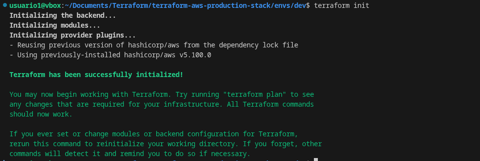

*Proceso de inicialización de Terraform con descarga de proveedores y módulos. Se configura el backend remoto en S3 y se prepara el ambiente para gestionar la infraestructura como código.*

---

### 2. 📊 VPC - Configuración de Red Principal
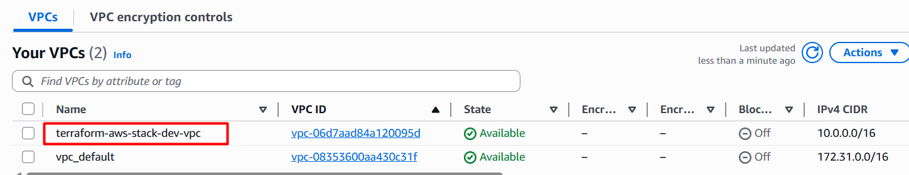

*Visualización de la VPC 10.0.0.0/16 con las 6 subredes (3 públicas y 3 privadas) distribuidas en 3 zonas de disponibilidad. Muestra el aislamiento de red, tablas de rutas y asociaciones de subredes.*

---

### 3. 🔀 Tablas de Rutas - Enrutamiento de Tráfico
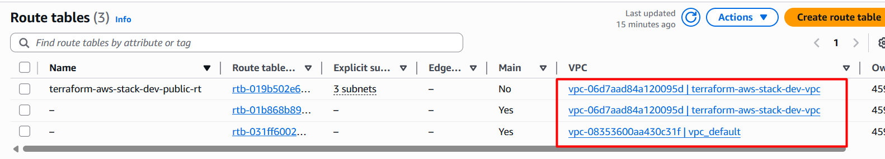

*Configuración de las tablas de rutas públicas y privadas. Muestra cómo el tráfico se dirige hacia Internet Gateway (públicas) y NAT Gateway (privadas), permitiendo egreso controlado desde subredes privadas.*

---

### 4. 🔐 Subnets - Aislamiento de Capas
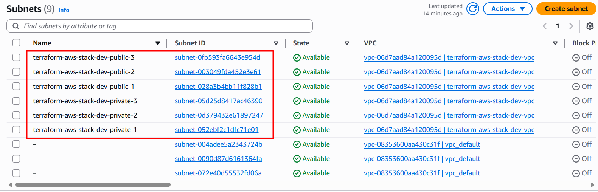

*Detalle de las 6 subredes con sus bloques CIDR específicos. Visualiza la distribución en zonas de disponibilidad, ubicación en AZs (AZa, AZb, AZc) y el estado de asociación a tablas de rutas.*

---

### 5. 🛡️ Security Groups - Firewall y Control de Acceso

*Configuración del primer Security Group con reglas de entrada y salida. Implementa el principio de menor privilegio permitiendo tráfico específico entre capas de la arquitectura.*

---

### 6. 🛡️ Security Groups Adicionales - Aislamiento de Componentes
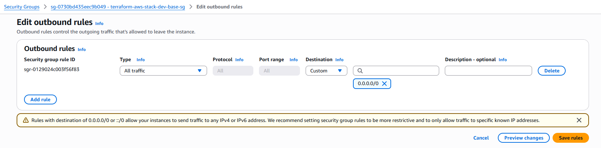

*Segundo conjunto de reglas de Security Groups para componentes específicos (ALB, EC2, RDS). Muestra aislamiento completo entre capas y restricción de puertos.*

---

### 7. ⚖️ Application Load Balancer - Balanceo de Carga
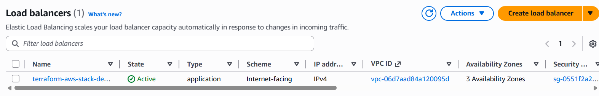

*Configuración del Application Load Balancer con detalles de red, subredes asociadas y grupos de seguridad. Prepara la distribución de tráfico entre instancias EC2.*

---

### 8. 🎯 ALB Listeners - Configuración de Puertos
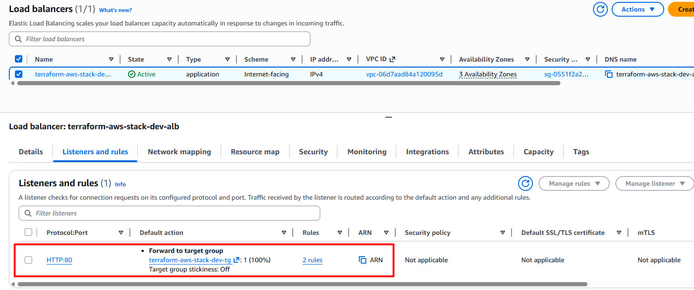

*Listeners configurados en el ALB para los puertos 80 (HTTP) y 443 (HTTPS). Muestra target groups dinámicos y routing rules para dirigir el tráfico a las instancias correctas.*

---

### 9. 🌐 ALB Endpoint - URL de Acceso
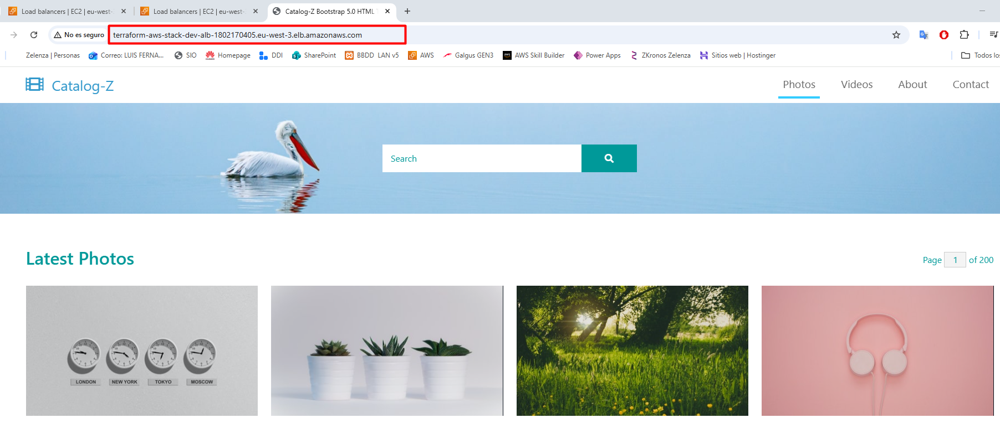

*ALB totalmente funcional con DNS name generado y estado activo. Muestra la URL completa para acceder a la aplicación y confirmación de health checks pasando.*

---

### 10. 📍 ALB Endpoint URL - Punto de Entrada
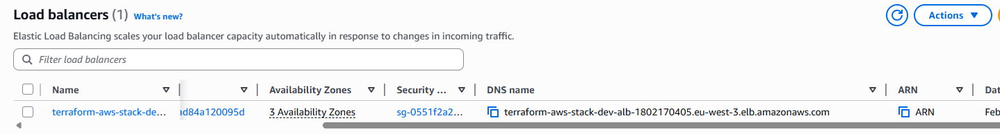

*Endpoint específico del ALB generado por AWS con el patrón de nombre estándar. Permite acceso externo a la infraestructura con balanceo de carga automático.*

---

### 11. 🖥️ EC2 Instancias - Compute en Ejecución
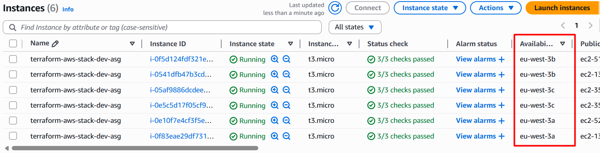

*Instancias EC2 t3.micro activas y en estado "running". Muestra información de instancia, zona de disponibilidad asignada y conexión a la VPC privada.*

---

### 12. 🔄 Auto Scaling Group - Escalado Automático
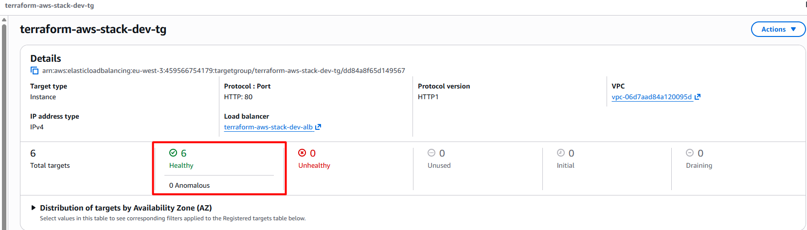

*Grupo Auto Escalado configurado con capacidad deseable de 1-3 instancias. Visualiza métricas de escalado, políticas asociadas y distribución en múltiples AZs.*

---

### 13. 💾 S3 General - Almacenamiento Estándar
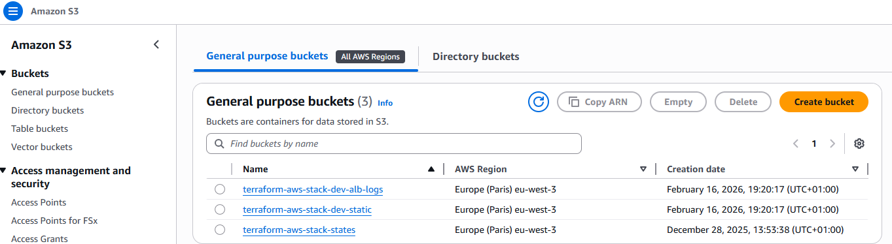

*Bucket S3 principal con configuración de almacenamiento general. Muestra versionado habilitado, encriptación por defecto y políticas de acceso.*

---

### 14. 📝 S3 Logs - Logs del ALB
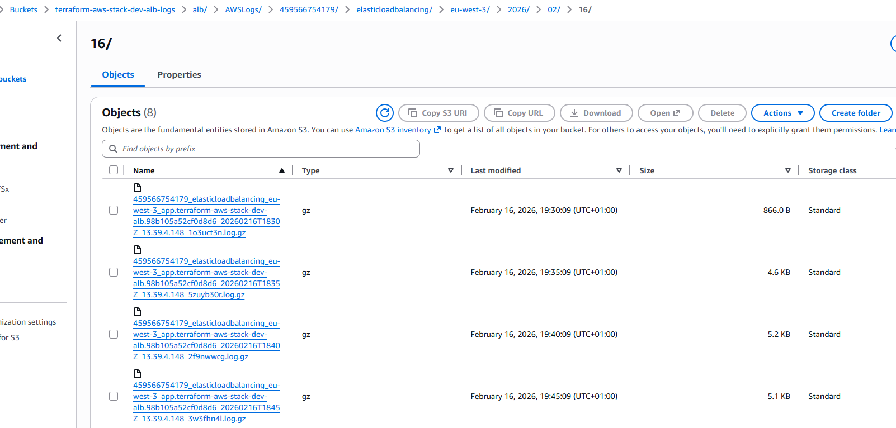

*Bucket S3 dedicado para almacenar logs del Application Load Balancer. Implementa políticas de ciclo de vida para gestionar la retención de logs automáticamente.*

---

### 15. 🌐 S3 Website - Sitio Estático
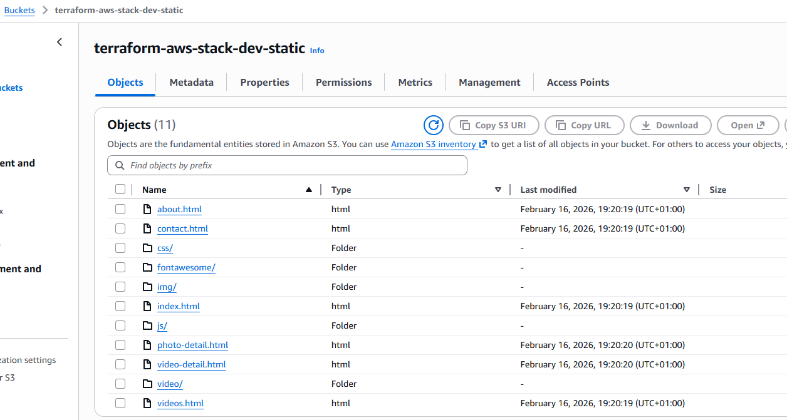

*Configuración de S3 como hosting de sitio web estático. Muestra el contenido servido directamente desde S3 con índice HTML y assets estáticos (CSS, JS, imágenes).*

---

### 16. 📋 Terraform State List - Recursos Creados
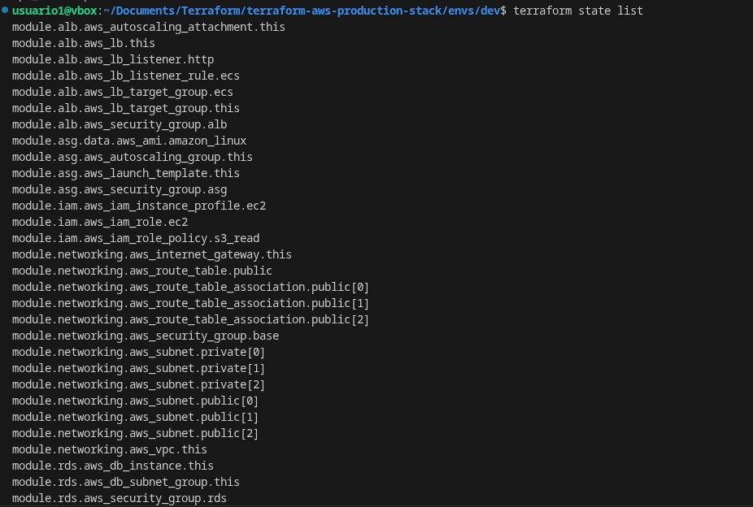

*Listado completo de los 80+ recursos creados y gestionados por Terraform. Muestra el estado centralizado de toda la infraestructura en AWS.*

---

### 17. 🗂️ Estructura de Carpetas - Organización del Proyecto
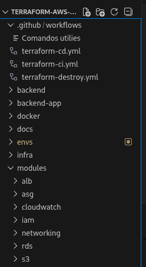

*Organización modular del proyecto con carpetas para envs (dev, prod, stage), modules y docs. Muestra la estructura escalable y reutilizable del código IaC.*

---

### 18. 🚀 GitHub Workflows - CI/CD Pipelines
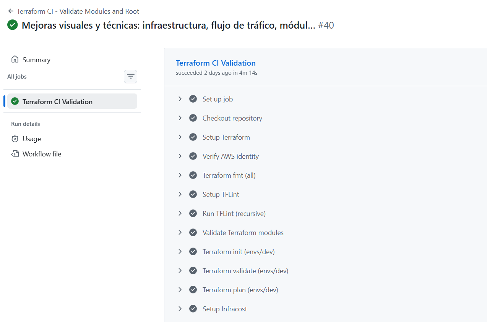

*Workflows de GitHub Actions configurados para automatización. Incluye terraform-ci.yml y terraform-cd.yml para validación y despliegue automático.*

---

### 19. ⚙️ GitHub Pipelines - Estado de Ejecución
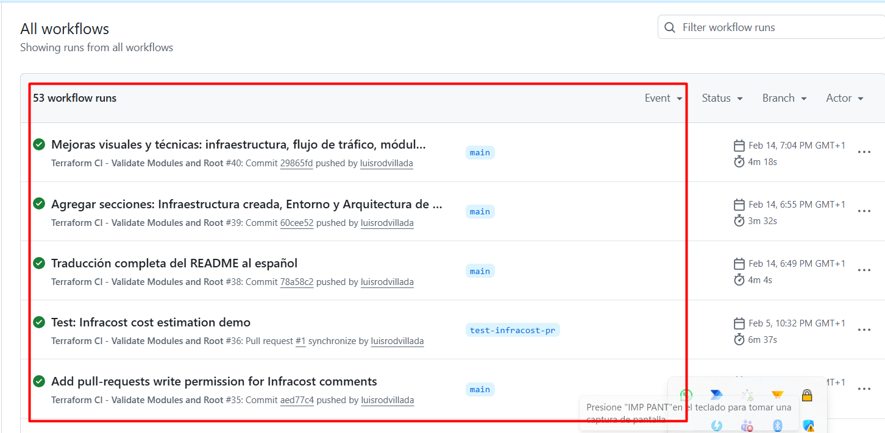

*Estado de ejecución de los pipelines de CI/CD. Muestra logs de validación, plan de cambios y ejecución automática de terraform apply en entornos designados.*

---

### 20. 🧹 Terraform Destroy - Limpieza de Infraestructura
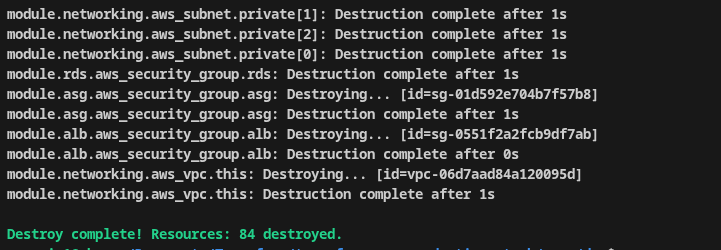

*Ejecución controlada de `terraform destroy` demostrando la capacidad de desmantelar completamente la infraestructura. Muestra cómo con un comando se liberan todos los 80+ recursos de forma segura.*

---

### 21. 📦 AWS Resources - Resumen de Recursos por Tipo
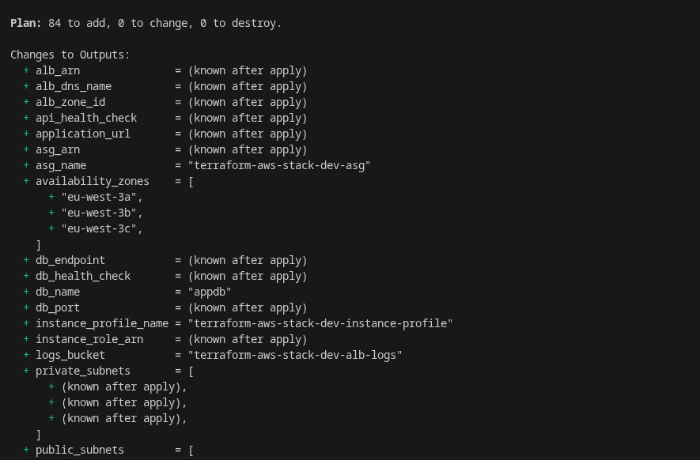

*Vista general de los tipos de recursos creados en AWS categorizados por servicio (EC2, RDS, S3, etc.).*

---

### 22. 📦 AWS Resources 2 - Detalles Adicionales

*Detalles adicionales de recursos con información de disponibilidad, estado y configuración específica.*

---

### 23. 📦 AWS Resources 3 - Recursos de Red
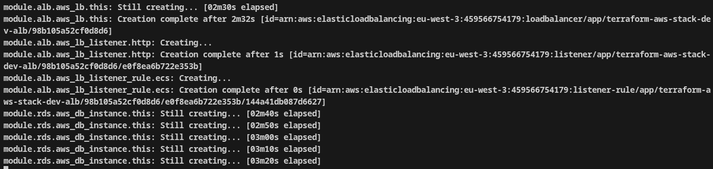

*Recursos de red detallados incluyendo VPC, subnets, route tables y NAT Gateway con configuración específica.*

---

### 24. 📦 AWS Resources 4 - Recursos de Compute
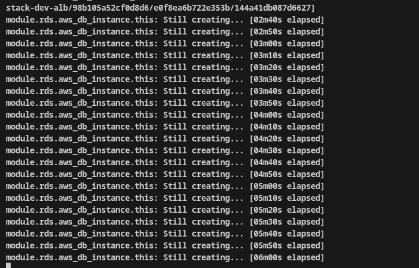

*Recursos de compute incluyendo Auto Scaling Group, Launch Templates y configuración de instancias EC2.*

---

### 25. 📦 AWS Resources 5 - Recursos de Base de Datos
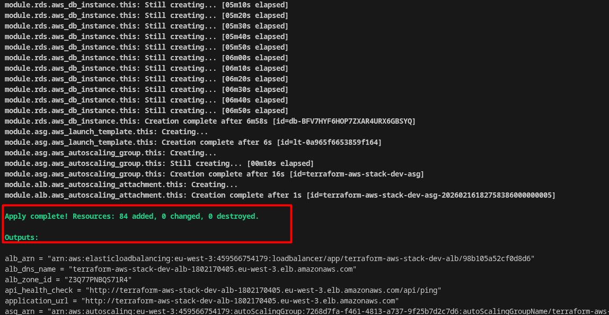

*Recursos de base de datos RDS PostgreSQL con configuración Multi-AZ, snapshots y parámetros de seguridad.*

---

## 📊 Resumen de Capturas

| # | Componente | Archivo | Estado |
|---|-----------|---------|--------|
| 1 | Terraform Init | `terraform-init.png` | ✅ |
| 2 | VPC Principal | `vpc.png` | ✅ |
| 3 | Tablas de Rutas | `route-tables.png` | ✅ |
| 4 | Subnets | `subnets.png` | ✅ |
| 5 | Security Groups | `security-groups.png` | ✅ |
| 6 | Security Groups 2 | `security-groups2.png` | ✅ |
| 7 | ALB Config | `alb.png` | ✅ |
| 8 | ALB Listeners | `listeners.png` | ✅ |
| 9 | ALB Working | `alb-working.png` | ✅ |
| 10 | ALB Endpoint | `alb-endpoint.png` | ✅ |
| 11 | EC2 Instances | `instancias.png` | ✅ |
| 12 | ASG | `asg.png` | ✅ |
| 13 | S3 General | `s3-general.png` | ✅ |
| 14 | S3 Logs | `s3-logs.png` | ✅ |
| 15 | S3 Website | `s3-page.png` | ✅ |
| 16 | State List | `state-list.png` | ✅ |
| 17 | Folders | `folders.png` | ✅ |
| 18 | Workflows | `workflows.png` | ✅ |
| 19 | Pipelines | `pipelines.png` | ✅ |
| 20 | Terraform Destroy | `terraform-destroy.png` | ✅ |
| 21 | Resources | `Resources.png` | ✅ |
| 22 | Resources 2 | `Resources2.png` | ✅ |
| 23 | Resources 3 | `Resources3.png` | ✅ |
| 24 | Resources 4 | `Resources.4.png` | ✅ |
| 25 | Resources 5 | `Resources.5.png` | ✅ |

---

## 🎯 Orden de Importancia

1. **Crítica:** Terraform Init, VPC, Subnets, Security Groups, ALB, EC2, State List
2. **Alta:** Route Tables, Listeners, S3, ASG, Workflows
3. **Referencia:** Resources, Folders, Pipelines, Destroy

---

## 📌 Notas

- Todas las imágenes están en formato PNG de alta calidad
- El orden refleja el flujo de despliegue desde inicialización hasta destrucción
- Las descripciones incluyen contexto técnico y relación con otros componentes

[← Volver al README](../README.md)
