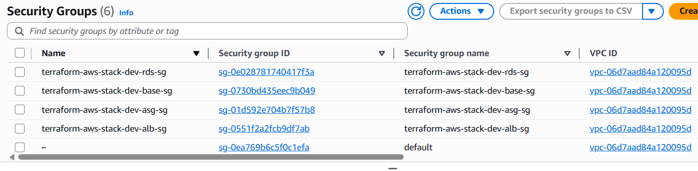

# 📸 Galería de Screenshots - Despliegue de Infraestructura AWS

> Colección completa de capturas del proceso de despliegue, configuración y operación de la infraestructura Terraform en AWS

[← Volver al README](../README.md)

---

## 📸 Capturas Adicionales del Despliegue

### 6. VPC y Subredes Configuradas

*Descripción: Visualización de la VPC 10.0.0.0/16 con las 6 subredes (3 públicas y 3 privadas) distribuidas en 3 zonas de disponibilidad. Muestra el aislamiento de red y las relaciones entre subredes.*

---

### 7. Security Groups y Reglas de Firewall

*Descripción: Configuración de los Security Groups aplicados a cada capa de la arquitectura. Muestra las reglas de entrada y salida, el principio de menor privilegio implementado, y el aislamiento de tráfico entre capas.*

---

### 8. Application Load Balancer - Health Checks

*Descripción: Dashboard del ALB mostrando los health checks activos de las instancias EC2. Visualiza la distribución de tráfico, estado de los targets y configuración de listeners en puertos 80/443.*

---

### 9. RDS PostgreSQL Multi-AZ

*Descripción: Configuración de la base de datos RDS PostgreSQL con replicación Multi-AZ. Muestra la instancia primary, la replica en standby, la región de despliegue y la configuración de backups automáticos.*

---

### 10. CloudWatch Metrics y Monitoring

*Descripción: Dashboard de CloudWatch mostrando métricas en tiempo real de CPU, memoria, tráfico de red y actividad de la base de datos. Demuestra las capacidades de monitoreo y observabilidad de la infraestructura.*

---

### 11. S3 Buckets para Logs y Contenido Estático

*Descripción: Configuración de buckets S3 para almacenamiento de logs del ALB y contenido estático. Muestra versionado habilitado, políticas de ciclo de vida, y encriptación por defecto.*

---

### 12. IAM Roles y Políticas

*Descripción: Estructura de roles IAM y políticas de permisos aplicadas a las instancias EC2 y recursos de AWS. Demuestra la implementación de least privilege principle y trust relationships.*

---

### 13. Terraform State en S3 Remoto

*Descripción: Backend remoto de Terraform almacenado en S3 con versionado y bloqueos DynamoDB. Muestra cómo se gestiona centralmente el estado para colaboración en equipo y seguridad.*

---

### 14. Logs de Despliegue - Terraform Output

*Descripción: Output completo de `terraform apply` mostrando todos los recursos creados, sus IDs, y outputs exportados. Incluye la URL del ALB, endpoint de RDS, IDs de VPC y otros datos críticos.*

---

### 15. Cost Explorer - Análisis de Costos

*Descripción: Dashboard de AWS Cost Explorer mostrando el desglose de costos por servicio. Visualiza gastos en EC2, RDS, NAT Gateway, ALB y S3 versus el presupuesto estimado de ~$81.50/mes.*

---

## 📊 Resumen de Capturas

| # | Componente | Archivo | Estado |
|---|-----------|---------|--------|
| 1 | Terraform Init | `terraform-init.png` | ✅ |
| 2 | State List | `state-list.png` | ✅ |
| 3 | EC2 Instances | `instancias.png` | ✅ |
| 4 | ASG Scaling | `asg.png` | ✅ |
| 5 | Terraform Destroy | `terraform-destroy.png` | ✅ |
| 6 | VPC Subnets | `vpc-subnets.png` | 📝 |
| 7 | Security Groups | `security-groups.png` | 📝 |
| 8 | ALB Health Checks | `alb-health-checks.png` | 📝 |
| 9 | RDS Multi-AZ | `rds-multi-az.png` | 📝 |
| 10 | CloudWatch Metrics | `cloudwatch-metrics.png` | 📝 |
| 11 | S3 Buckets | `s3-buckets.png` | 📝 |
| 12 | IAM Roles | `iam-roles-policies.png` | 📝 |
| 13 | Terraform State | `terraform-state-s3.png` | 📝 |
| 14 | Terraform Output | `terraform-output.png` | 📝 |
| 15 | Cost Analysis | `cost-explorer.png` | 📝 |

**Leyenda:** ✅ Disponible | 📝 Pendiente de añadir

---

## 🚀 Instrucciones para Añadir Screenshots

1. Coloca las imágenes en el directorio `docs/images/`
2. Nombra los archivos según el patrón: `feature-name.png`
3. Reemplaza el placeholder `` con la ruta correcta
4. Actualiza la descripción con detalles específicos de la captura
5. Mantén el formato de separadores `---` para consistencia visual

---

## 📌 Notas

- Todas las imágenes deben estar en formato PNG (200+ KB recomendado para calidad)
- Las descripciones deben ser técnicas pero accesibles para diferentes niveles
- Este documento sirve como galería expandida para portfolios y documentación técnica

[← Volver al README](../README.md)
